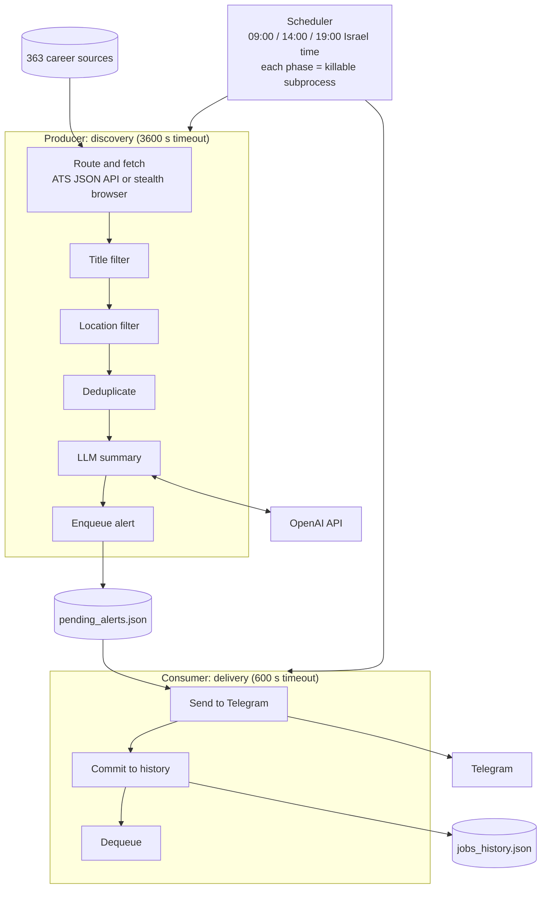

# Steve Jobs Searcher Agent

An autonomous job-hunting agent that scans **363 Israeli tech employers** three
times a day and sends only relevant **junior and student** openings to Telegram,
each with a short AI-written summary.


## Why

Entry-level tech roles in Israel are spread across hundreds of career sites and a
dozen applicant tracking systems (ATS). Job boards are late and noisy, and good
junior roles fill fast. This agent reads each employer's own hiring system
directly, filters out senior and foreign roles with deterministic rules before
any AI cost, has an LLM summarize what is left against the candidate's profile,
and delivers a de-duplicated alert.

## Highlights

| | |
| --- | --- |
| Companies monitored | 363 |
| ATS platforms | 15: Comeet, Greenhouse, Ashby, Workday, Lever, SmartRecruiters, Workable, SuccessFactors, Phenom, Oracle, Eightfold, Amazon, plus custom sites |
| Fetch paths | 295 companies via JSON APIs, 68 via a stealth headless browser |
| Schedule | Daily at 09:00, 14:00 and 19:00 Israel time |
| Tests | 273 tests, every external service mocked |
| Runs on | Docker Compose on AWS EC2 |

## What it does

1. **Monitors employers directly** through their ATS API or career page.
2. **Keeps entry-level tech roles only.** Title rules in English and Hebrew
   require an entry-level signal (student, junior, intern, graduate) and a
   target domain (software, data, product, security). Senior and management
   titles are rejected.
3. **Keeps jobs in Israel only**, including when the ATS reports a bare city
   name such as "Herzliya" or "TLV".
4. **Never sends the same job twice**, checking delivered history, the pending
   queue and the current scan.
5. **Writes a personal summary** with OpenAI `gpt-4o-mini`: role, hard
   requirements, a fit score and what to highlight in a CV.
6. **Delivers reliably** through a durable queue; failed sends retry next cycle.
7. **Reports on itself** with a heartbeat on quiet cycles and a health digest
   when a company's scraper breaks or recovers.

## Architecture

Discovery and delivery run as separate processes. The only thing they share is
a crash-safe queue on disk.



Design guarantees:

- **No lost alerts.** If Telegram is down, alerts wait in the queue.
- **No duplicates after a crash.** History is written before the alert leaves
  the queue, so the next run can clean up an interrupted delivery.
- **No corrupt state.** Every JSON write is temp file, `fsync`, then atomic
  `os.replace`.
- **No hung cycles.** A stuck browser is killed by the subprocess timeout; the
  scheduler keeps running.
- **No AI spend on junk.** Deterministic filters run before any LLM call.
- **No silent breakage.** Every adapter returns a typed `ScrapeResult`
  (`SUCCESS`, `NO_JOBS`, `WAF_BLOCKED`, `FAILED`) that feeds a per-company
  health tracker.

The reasoning behind each decision is recorded in [`docs/adr/`](docs/adr/).

## Example alert

Alerts are written in Hebrew. The format looks like this (illustrative values):

```text
🚨 משרה חדשה נמצאה: Junior Backend Developer 🚨
🏢 חברה: Example Company
📍 מיקום: Tel Aviv, Israel
🔗 קישור: https://...

תפקיד ומיקום: ...
דרישות סף טכניות: ...
אחוז התאמה לפרופיל: ...
נקודות חוזק להדגשה בקורות החיים: ...
```

## Tech stack

Python 3.10+, `requests`, Playwright + `playwright-stealth`, BeautifulSoup4,
lxml, OpenAI API, Telegram Bot API, pytest, Docker, Docker Compose, AWS EC2.

## Project structure

```text
src/
  scheduler.py            Production entry point (fixed daily slots)
  pipeline.py             Local end-to-end runner (Windows, WARP toggling)
  scrapers/
    orchestrator.py       Producer: route, fetch, filter, dedupe, analyze, enqueue
    health.py             Per-company scraper health tracking
    api/                  Declarative ATS mapping table + generic JSON client
    browser/              Stealth Playwright driver + custom adapters
  analysis/
    filters/location.py   Israel location filter
    ai/analyzer.py        Prompt building, OpenAI call, cost logging
  notifications/          Consumer + Telegram notifier
  storage/                Atomic JSON stores: queue, history, health
  models/                 Shared ScrapeResult contract
config/
  companies.json          The company catalog (source of truth)
  prompts/                LLM system-prompt context
tests/unit/               Automated suite (all external services mocked)
tools/company_discovery/  Scripts used to verify and add new companies
docs/                     Architecture, domain glossary, ADRs
```

## Quick start

Requires Python 3.10+.

```bash
python -m venv .venv
source .venv/bin/activate            # Windows: .\.venv\Scripts\Activate.ps1
pip install -r requirements.txt
pip install -e .
python -m playwright install chromium

cp .env.example .env                 # then fill in your keys
pytest                               # run the test suite (no network needed)
```

Run the phases:

```bash
python -m scrapers.orchestrator      # producer: scan and queue alerts
python -m notifications.dispatcher   # consumer: deliver queued alerts
python -m scheduler                  # long-running scheduler (production mode)
```

Optionally add a private `config/prompts/user_profile.md` describing the
candidate; without it the analyzer uses a generic profile.

### Docker

```bash
docker compose up -d --build
docker compose logs -f steve_jobs_agent
```

The container runs as a non-root user. `data/`, `logs/` and `config/` are
mounted from the host so state survives rebuilds.

## Documentation

- [`docs/PROJECT_OVERVIEW.md`](docs/PROJECT_OVERVIEW.md): operations, deployment,
  log analysis and roadmap
- [`docs/ARCHITECTURE.md`](docs/ARCHITECTURE.md): detailed code map
- [`docs/CONTEXT.md`](docs/CONTEXT.md): domain vocabulary
- [`docs/adr/`](docs/adr/): architecture decision records

## How it was built

Built in 2026 by [Amit Yitshaki](https://github.com/AmitYitshaki) as tech lead of
a small AI team: Gemini as product manager, Codex as software engineer and
Claude Code as QA and DevOps. Architecture decisions, review and production
operation stayed with the human lead.

## License

[MIT](LICENSE)
